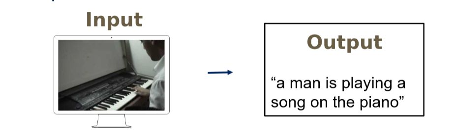
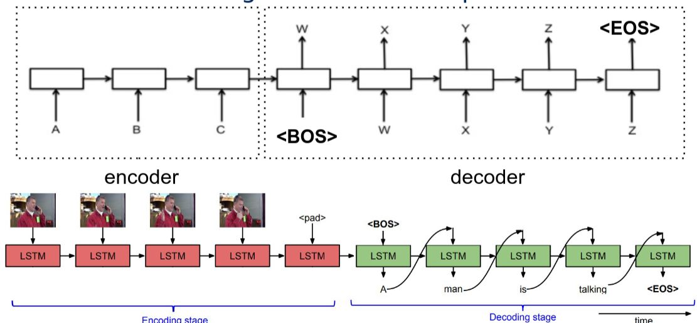
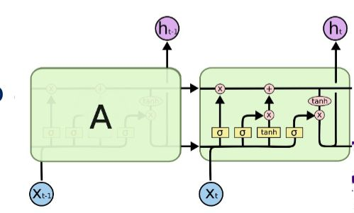

# CPSC8430_HW2
## 1 - Video Caption Generation
- Video caption generation is the process of taking an input video file, passing the frames through a CNN filter and feeding the resulting output into an recurrent neural network encoder / decoder schema in order to generate a sequence of weighted output arrays that correspond to the indices of a given word dictionary. Each array denotes the probability of a given word from that dictionary being selected with the total sequence corresponding to a generated phrase.   

- The dictionary also has special tags that indicated the start of sentence **\<SOS\>**, end of sentence **\<EOS\>**, an unknown **\<UNK\>**, and a blank position **\<PAD\>**.  
- The recurrent neural network is laid out as shown below:

## 2 - Sequence to Sequence Model
- This model comprises of two seperate components, the encoding of the CNN data, and the generation through a decoder of the language output.
- The heart of this network is the LSTM unit, which is a self contained cell that takes a matrix input and projects it to an output vector.

- The output vector is a 1-N mapping of the format \[0,0,0..1,0..0,0\] with the index of the non-zero value corresponding to the index position of a word in an attached dictionary text file.
- The encoding steps consist of chained LSTM units that take the CNN data, process it, then feed it forward to the next layer
- The output of the encoder is then fed into the decoding steps, which take a **\<SOS\>** signal vector input at the start, then recursively process and calculate probabilities for the rest of the sequence with each LSTM unit calculating the probabilities of the next word in the phrase.
## 3 - Model Implementation
- This implementation realizes this process by first preprocessing the input.
- The CNN data files are given in a feature data directory, along with .json files that contain known valid descriptive phrases for each of the attached videos.
- The .json files are parsed with the dict_loader.py python file which generates a dict.txt file where each line of the file corresponds to a unique word found in the descriptions of the videos.
- The .json files are again parsed and the captions of each video is extracted and converted to a matrix of arrays of 1-N mappings corresponding to the dictionary text file generated in the previous step.
- Each video, and it's corresponding CNN dataset are then fed into my model coded in the img_classifier.py file.
- Beam searching and attention aspects were not implemented due to time constraints.
- Training is accomplished by comparing model output with the known valid phrases, then loss is computed via a cross entropy loss calculation and fed back into the model to adjust the parameters of the LSTM steps
- This model converges very slowly, and the implementation of the previously mentioned techniques would help converge the model faster.
